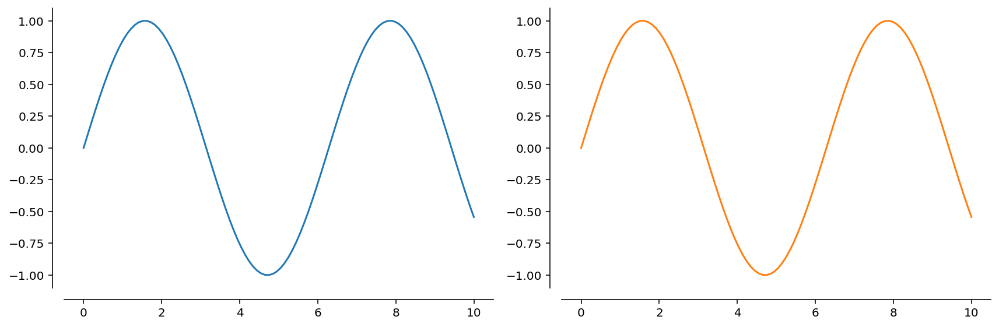
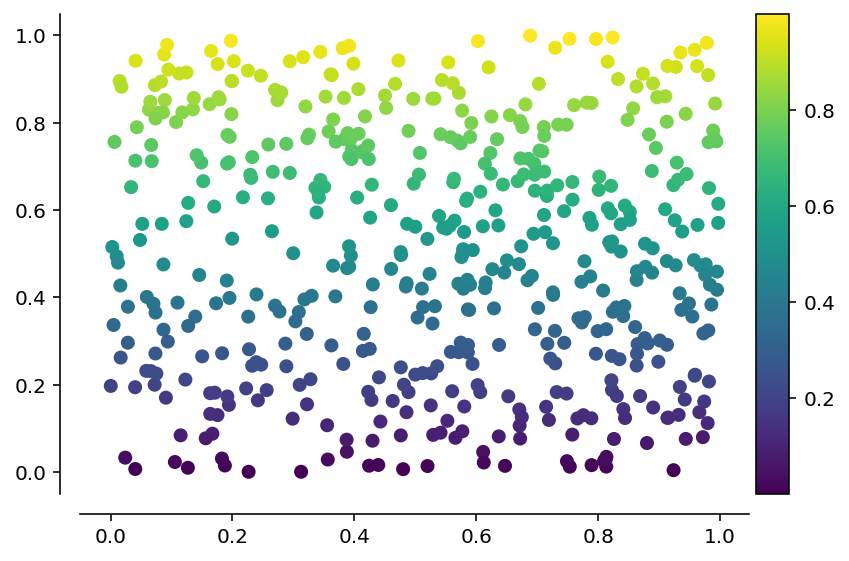
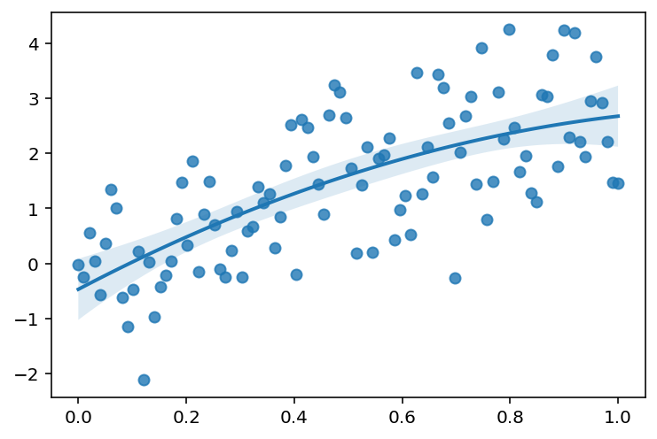
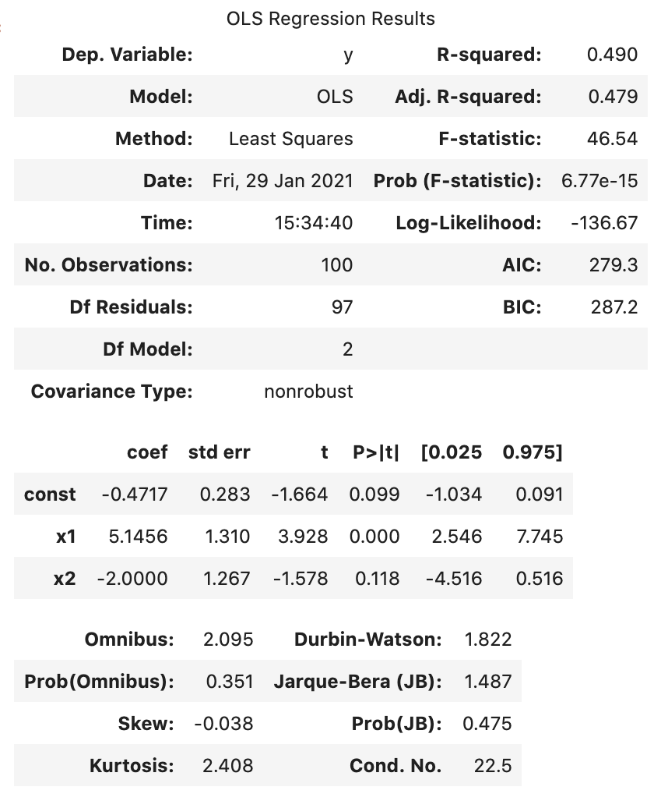

# pygrutils: an assortment of graphics utilities

This is an assortment of utilities for plotting in Python using [`matplotlib`](https://matplotlib.org/) and [`seaborn`](https://seaborn.pydata.org/generated/seaborn.regplot.html?highlight=regplot#seaborn.regplot). Below are some highlights.

## Features

### A figure manager

The default `matplotlib` figure uses a box around the figure. For most plots I find this to be both a waste of ink and a bit ugly. It can also make it hard to see points close to the edges of the figure. For these reasons, I usually use the [`despine`](https://seaborn.pydata.org/generated/seaborn.despine.html?highlight=despine#seaborn.despine) function from `seaborn` to remove the right and upper segments of the figure box, and also to add a bit of an offset between the remaining spines. Like this:

To automate this behavior, I created `FigureManager`, a context manager that basically calls `plt.subplots`, but also applies `despine` to the axes upon exit. For instance, the figure above can be obtained using:

    import numpy as np
    from pygrutils import FigureManager

    with FigureManager(1, 2) as (_, axs):
        x = np.linspace(0, 10, 100)
        for i, ax in enumerate(axs):
            ax.plot(x, np.sin(x), c=f"C{i}")

Note that the `FigureManager` also scales the figure size when using multiple panels so that each panel is the same size as the default figure. This is in contrast to `matplotlib`'s default behavior which is to keep the figure size fixed. The behavior of the `FigureManager` is fully configurable -- see the docstring and the example notebook in the `test` folder for details.

### A more useful `regplot`

The [`seaborn`](https://seaborn.pydata.org/) function [`regplot`](https://seaborn.pydata.org/generated/seaborn.regplot.html?highlight=regplot#seaborn.regplot) allows overlaying a fit line and confidence interval on a scatter plot. Unfortunately, it does not either a) provide a mechanism to access the fitting results, or b) allow plotting a user-provided fit line. This package provides a reimplementation [*] of `sns.regplot` that returns the `RegressionResults` structure from a [`statsmodels`](https://www.statsmodels.org/stable/index.html) linear fit. The implementation also provides functions `scatter`, `fitplot`, and `polyfit`, that are used by `regplot` to generate the scatter part of the plot, the fit line and confidence interval, and to obtain the fitting results, respectively.

[*] Some features of `sns.regplot` are not currently implemented. Others may behave slightly differently.

The `regplot` function provided here should function as a drop-in replacement for `sns.regplot` in most cases. The main disadvantage is that the styling options are slightly different, and so the results might not always match perfectly. In some cases this is by design (because I didn't like `seaborn`'s choices), but in other cases it's because I haven't yet implemented all the hacks that `seaborn` employs to yield good-looking plots.

There are some things that this `regplot` function does better than `sns.regplot`:

* **consistency:** all the fits are calculated using `statsmodels`, even the polynomial ones.
* **speed:** confidence intervals are calculated directly using `statsmodels`, removing the need for bootstrapping.
* **flexibility:** polynomial fits in `log(x)` work are not allowed in `sns.regplot` but work here.
* **configurability:**

  * the number of points used for the fit line and confidence interval is configurable;
  * separate keyword options for confidence intervals are supported.

### Colorbar and colormap functions

The default colorbar function in `matplotlib` is not always easy to use and often leads to a colorbar whose height is not matched to the figure. The `colorbar` function in `pygrutils` makes this easy (using code inspired from [Stackoverflow](https://stackoverflow.com/a/18195921)). Additionaly, `plt.colorbar` does not work with `scatter`, whereas `gr.colorbar` does:

    import pygrutils as gr

    rng = np.random.default_rng(0)
    with gr.FigureManager() as (_, ax):
        n = 500
        x = rng.uniform(size=n)
        y = rng.uniform(size=n)
        h = ax.scatter(x, y, c=y)
        gr.colorbar(h)

## Installation

After cloning the repository or downloading and decompressing, run the following command in the folder containing `setup.py`:

    pip install .

## Usage

The basic usage is identical to `seaborn`, *e.g.*:

    import matplotlib.pyplot as plt
    import pygrutils as gr
    import numpy as np

    # generate some data
    rng = np.random.default_rng(0)
    x = np.linspace(0, 1, 100)
    y = 3.0 * x - 0.15 + rng.normal(size=len(x))

    # plot it
    fig, ax = plt.subplots()
    res = gr.regplot(x, y, order=2, ax=ax)

will make a scatter plot of `y` *vs.* `x`, fitting a second-order polynomial through the data:

The `statsmodels` results structure contains a wealth of information:

    res.summary()

More examples can be found in the notebooks in the `test` folder.
